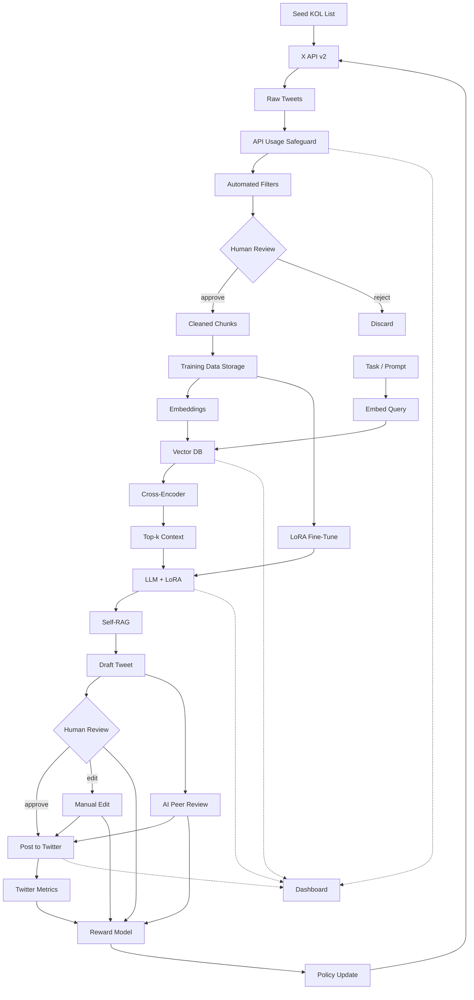

# Xinfluencer AI: Architecture & Data Flywheel

A sophisticated self-learning AI agent that analyzes crypto influencer content using a bot-influencer architecture with data flywheel approach.

## High-Level Flow Diagram

## Core Innovation: Enhanced Data Flywheel Architecture

At launch the agent is given a seed list of ~20 trusted KOL accounts. The **Enhanced Data Collection Pipeline** with **API Usage Safeguard** ensures safe, rate-limited collection while humans watch its first outputs (the bootstrap gate). Automated filters kill spam, bots and toxic tweets. Clean chunks are stored in **Training Data Storage** with comprehensive metadata before being embedded into a GPU-backed vector DB. At inference the model uses Self-RAG—retrieve → draft → re-retrieve & critique—to write tweets with a certain personality. Every draft is scored three ways: (1) humans, (2) an "AI peer" critic running raw GPT-4o, and (3) real Twitter engagement. All three signals feed a reward model; once a week a PPO policy update (via the Hugging-Face TRL library) shifts what the bot reads and how it speaks. Meanwhile a daily LoRA micro-tune nudges the LLM itself. A Prometheus + Grafana dashboard plus the RAGAS evaluation library surface retrieval precision, faithfulness and latency so ops can see drift in real time.

## Enhanced Data Acquisition Strategy

Our system employs a sophisticated **Enhanced Data Collection Pipeline** that combines comprehensive X API v2 integration with safety mechanisms and training optimization.

### Stage 1: Safe Collection with API Safeguard
The **EnhancedDataCollectionPipeline** implements intelligent rate limiting and usage tracking:

- **API Usage Safeguard**: Monitors post limits (1000/hour, 10000/day) and API call limits to prevent quota exhaustion
- **Batch User ID Resolution**: Optimizes API usage by caching user IDs and batch processing lookups
- **Comprehensive Collection**: Combines KOL data, trending tweets, and high-engagement content in a single pipeline
- **Training Integration**: Automatically stores high-quality content in SQLite with metadata for fine-tuning

### Stage 2: X API v2 Integration with Enhanced Client
Our **XAPIClient** provides robust, targeted data collection with intelligent caching:

**Endpoint:** `GET /2/tweets/search/recent`

**Enhanced Features:**
- **Intelligent Caching**: User data and tweet metadata cached to minimize API calls
- **Batch Processing**: User ID resolution and tweet collection optimized for efficiency
- **Error Recovery**: Automatic retry logic with exponential backoff
- **Usage Tracking**: Detailed logging of API calls and rate limit status

**Key Parameters & Fields:**

| Parameter | Details |
|---|---|
| `query` | **Value:** `from:<KOL_username> -is:retweet -is:reply` **Purpose:** Fetches tweets directly from a specific KOL, excluding retweets and replies to focus on original content. |
| `max_results` | **Value:** `100` **Purpose:** Retrieves the maximum number of tweets per request to ensure we capture a comprehensive set of recent activity. |
| `tweet.fields` | **Value:** `created_at,public_metrics,non_public_metrics,text,author_id,lang,possibly_sensitive,referenced_tweets,context_annotations` **Purpose:** Specifies the exact fields we need: - **`created_at`**: For recency filtering. - **`public_metrics`**: `like_count`, `retweet_count` for reward model. - **`non_public_metrics`**: `impression_count` for a stronger reward signal (requires user auth). - **`text`**: Raw content for analysis. - **`author_id`, `lang`**: For verification and filtering. - **`context_annotations`**: **Crucial for filtering content to the "crypto" and "RWA" space.** - **`possibly_sensitive`, `referenced_tweets`**: For quality and originality filters. |
| `user.fields` | **Value:** `public_metrics,verified` **Purpose:** Gathers user-level data: - **`verified`**: Authenticity signal. - **`public_metrics`**: `followers_count` to gauge KOL influence. |
| `expansions` | **Value:** `author_id` **Purpose:** Ensures the full user object is returned alongside the tweet, allowing us to access the requested `user.fields`. |

**Post-Fetch Processing:**
After retrieval, the **TrainingDataStorage** system applies quality filters and stores content with comprehensive metadata including:
- Collection session tracking
- Quality scores and crypto relevance
- Engagement metrics and author information
- Timestamp and processing metadata

This configuration allows us to build a high-signal dataset of original content from trusted sources, which is essential for the quality of our downstream AI generation tasks.

## KOL Performance Metrics

To objectively measure and compare the effectiveness of different Key Opinion Leaders (KOLs), especially when they have varying audience sizes, we will use a set of normalized metrics. This approach moves beyond simple vanity metrics (like raw follower counts) to a more nuanced "formula" based on ratios.

The primary objective is to refine our KOL list and inform the AI's content strategy by identifying accounts that generate high-quality engagement relative to their size. Given that we are operating on the Twitter API's Basic plan, we will focus on the metrics available within its limits.

| Metric | Formula / Description | Purpose |
|---|---|---|
| **Engagement Rate per Post** | `(Likes + Retweets + Replies) / Follower Count` at time of posting | Measures the percentage of an influencer's audience that actively engages with their content. This is a core indicator of content quality and audience connection. |
| **Influence Growth Rate** | `(Followers_end - Followers_start) / Followers_start` | Measures the percentage change in an influencer's follower count over a defined period (e.g., weekly, monthly). This indicates their growing or waning relevance in the space. |
| **Content-Specific Performance** | Analyze Engagement Rate for tweets related to specific topics (e.g., "crypto", "RWA") using `context_annotations`. | Identifies which KOLs are most effective in our specific domains of interest. This directly informs the AI's content and retrieval strategy. |

By tracking these metrics, we can create a dynamic and data-driven process for managing our KOL list, ensuring we are learning from the most impactful voices in the target domains.

## Technical Architecture

### 1. Enhanced Data Collection (Loop 1)

| Component | Method | Features |
|-------|--------|-----------|
| API Safeguard | Rate limiting + usage tracking | Prevents quota exhaustion, tracks efficiency |
| Batch Processing | User ID caching + batch lookups | Optimizes API usage, reduces calls |
| Training Storage | SQLite + metadata | Comprehensive data tracking for fine-tuning |
| Quality Gates | Multi-stage filtering | Language, toxicity, bot detection, perplexity |

Only messages passing **all** checks are chunked (256 tokens) and embedded.

### 2. Retrieval Loop (Loop 2)

* **Embedding model:** `bge‑large‑en` (or `text‑embedding‑3‑small` if using OpenAI).  
* **Index:** HNSW < 10 M vectors; migrate to IVF‑PQ + GPU search above that.  
* **Re‑ranking:** ColBERT‑v2 cross‑encoder adds ~10–15 % precision.  
* **Key metrics:** precision@5, recall@10, context‑precision (RAGAS).  
* **Trigger:** re‑index when precision@5 drops by 5 % WoW.

### 3. Generation Loop (Loop 3)

| Hyper‑param | Value | Note |
|-------------|-------|------|
| Base model | Llama 3.1 8B Instruct | open‑weights |
| LoRA rank `r` | 16 | quality / VRAM trade‑off |
| Alpha | 2 × r | scaling rule |
| LR (AdamW) | 1 × 10⁻⁴ | tune first |
| Epochs | 1 | avoid over‑fit |

Daily micro‑adapters are merged back every 4–6 weeks to prevent adapter sprawl.

**Self‑RAG + Reflexion**: model critiques and iterates once before final post; cuts hallucinations ~30 %.

### 4. Behaviour Loop (Loop 4)

* **Reward model inputs:** likes, retweets, CTR, follower delta (positive); toxicity, off‑topic, low faithfulness (negative). Human and AI peer labels feed the same reward model used by PPO.  
* **Policy learner:** PPO updated weekly with 1‑step importance sampling.  
* **AI peer review:** a raw, non‑fine‑tuned GPT‑4o critiques every draft and supplies automatic feedback signals.  
* **Safety valve:** if faithfulness < 0.9 or toxicity > 0.6, auto‑block posting & alert human.  
* **Implementation tip:** every manual *reject* or "major edit" is logged as a −1 reward; the next PPO cycle penalises that action pattern so the policy avoids it.

### 5. Daily Cadence (SGT)

| Time | Job | Loop |
|------|-----|------|
| 01:00 | Safe collection → run quality gate | 1 |
| 02:00 | Embed & upsert vectors; rebuild ANN & re‑rank index | 2 |
| 03:00 | LoRA fine‑tune on new high‑quality chunks | 3 |
| 09 – 23 h | Agent reads, answers, posts (Self‑RAG active) | 2‑3 |
| 23:30 | Aggregate metrics → reward logs → PPO update | 4 |

### 6. Golden‑Signal Dashboard

| Signal | Threshold | Action |
|--------|-----------|--------|
| Retrieval precision@5 | ↓ > 5 % WoW | re‑index |
| Faithfulness | < 0.90 | tighten filters / retrain generator |
| Hallucination rate | ↑ WoW | increase Self‑RAG passes |
| p95 latency | > 2 s | scale index / lower k |
| Adapter count | > 8 | merge weights |
| API usage efficiency | < 0.8 | optimize collection strategy |

### 7. Knowledge‑Graph Hybrid

Immutable data (e.g., LBMA rules) lives in a Neo4j KG.  
Retriever first queries KG; if miss, fall back to vector DB, ensuring critical facts never drift.

## Future Enhancements

**These modules are represented in the dashed "Future Modules" node of the diagram.**  
* **Multi‑lingual switch**: add language‑specific adapters & embeddings.  
* **On‑device summariser**: distil daily streams into trend reports.  
* **Synthetic user simulator**: generate interaction traces to pre‑train behaviour policy before launch.

## Abbreviation Glossary

| Term | Meaning / Role in Flow |
|------|------------------------|
| **Self‑RAG** | After drafting, the model *re‑retrieves* supporting evidence from the vector DB and critiques or rewrites its own output for factual accuracy. |
| **LoRA (Low‑Rank Adaptation)** | Parameter‑efficient fine‑tuning that injects small rank‑r weight matrices; only ≈2 % of parameters are updated daily. |
| **PPO (Proximal Policy Optimisation)** | RL algorithm that maximises a clipped surrogate objective to keep policy updates stable. Implemented via the **TRL** (Transformer Reinforcement Learning) library from Hugging Face. |
| **TRL** | Open‑source Python library offering PPO, DPO and other RL algorithms tailored for transformer models. |
| **Enhanced Data Collection** | Comprehensive pipeline combining API safety, batch processing, and training integration for optimal data acquisition. |

---

## Vision & Goals

Our ambition is to create the most sophisticated AI agent for crypto content generation, one that continuously learns and improves from real-world engagement data. By combining advanced retrieval-augmented generation with multi-signal evaluation and continuous learning, we aim to set new standards for AI-generated content quality and authenticity.

The enhanced data flywheel approach ensures that every piece of content contributes to improving future generations, creating a virtuous cycle of quality improvement that scales with usage. This positions Xinfluencer as not just a content generation tool, but as a continuously evolving AI system that becomes more valuable over time.
