# Bot‑Influencer Architecture & Data Flywheel

At launch the agent is given a seed list of ~100 trusted KOL accounts. Humans watch its first outputs (the bootstrap gate) while automated filters kill spam, bots and toxic tweets. Clean chunks go into a GPU-backed vector DB. At inference the model uses Self-RAG—retrieve → draft → re-retrieve & critique—to write tweets with a certain personality. Every draft is scored three ways: (1) humans, (2) an “AI peer” critic running raw GPT-4o, and (3) real Twitter engagement. All three signals feed a reward model; once a week a PPO policy update (via the Hugging-Face TRL library) shifts what the bot reads and how it speaks. Meanwhile a daily LoRA micro-tune nudges the LLM itself. A Prometheus + Grafana dashboard plus the RAGAS evaluation library surface retrieval precision, faithfulness and latency so ops can see drift in real time. LoRA's key knobs are the rank *r* (we use 16) and scaling factor α (≈ 2 × *r*); they decide how many new parameters the adapter learns (~2 % of the model) and how strongly they steer the frozen weights, while **RAGAS** (Retrieval‑Augmented‑Generation Assessment Suite) tracks context‑precision, faithfulness, answer‑relevancy and latency so we spot drift early.

## 🔄 High‑Level Flow Diagram

```mermaid
flowchart TD
    %% ========== INGESTION ==========
    KOL["Seed KOL List<br/>(~100 experts)"] --> TWAPI("Twitter API<br/>(Tweepy)")
    TWAPI --> RAW["Raw Tweets<br/>(JSON)"]

    %% ========== DATA QUALITY & HUMAN ALIGNMENT ==========
    RAW --> QC["Automated Filters<br/>(lang ✔, toxicity ✔,<br/>bot ✔, perplexity ✔)"]
    QC --> HREV{"Human Align<br/>Review (bootstrap)"}
    HREV -- "approve" --> CHUNK["Cleaned<br/>256‑token chunks"]
    HREV -- "reject" --> DISCARD["Discard"]

    %% ========== VECTOR & RAG ==========
    CHUNK --> EMB["Embeddings<br/>(bge‑large‑en)"]
    EMB --> VDB["Vector DB<br/>(Qdrant + cuVS)"]

    subgraph RAG["Retrieval‑Augmented Generation"]
        QUERY["Task / Prompt"] --> QEMB["Embed Query"]
        QEMB --> VDB
        VDB --> RERANK["Cross‑Encoder<br/>(ColBERT‑v2)"]
        RERANK --> CONTEXT["Top‑k Context"]
    end

    %% ========== GENERATION & SELF‑CRITIQUE ==========
    CONTEXT --> LLM["LLM (Mistral‑7B)<br/>+ Daily LoRA"]
    LLM --> SELF["Self‑RAG<br/>(re‑retrieve + critique)"]
    SELF --> DRAFT["Draft Tweet"]

    %% ========== REVIEW CHANNELS ==========
    DRAFT --> POREV{"Human Review?<br/>(early phase)"}
    DRAFT --> AIREV["AI Peer Review<br/>(raw GPT‑4o)"]

    POREV -- "approve / minor" --> POST["Post to Twitter"]
    POREV -- "edit" --> EDIT["Manual Edit"]
    EDIT --> POST
    EDIT --> REWARD
    AIREV --> POST

    %% ========== FEEDBACK / REWARD ==========
    POST --> METRICS["Twitter Metrics<br/>(views • likes • reposts)"]
    POREV --> REWARD["Reward Model"]
    AIREV --> REWARD
    METRICS --> REWARD

    REWARD --> PPO["Policy Update<br/>(PPO via TRL)"]
    PPO --> TWAPI

    %% ========== CONTINUAL TUNING ==========
    CHUNK --> LORAFT["LoRA Fine‑Tune<br/>(daily)"]
    LORAFT --> LLM

    %% ========== MONITORING ==========
    VDB -.-> DASH["Dash<br/>(Prom • RAGAS)"]
    LLM -. faithfulness .-> DASH
    POST -. brand‑drift .-> DASH

```

### Abbreviation Glossary
| Term | Meaning / Role in Flow |
|------|------------------------|
| **Self‑RAG** | After drafting, the model *re‑retrieves* supporting evidence from the vector DB and critiques or rewrites its own output for factual accuracy. |
| **LoRA (Low‑Rank Adaptation)** | Parameter‑efficient fine‑tuning that injects small rank‑r weight matrices; only ≈2 % of parameters are updated daily. |
| **PPO (Proximal Policy Optimisation)** | RL algorithm that maximises a clipped surrogate objective to keep policy updates stable. Implemented via the **TRL** (Transformer Reinforcement Learning) library from Hugging Face. |
| **TRL** | Open‑source Python library offering PPO, DPO and other RL algorithms tailored for transformer models. |

---

## 1. Data‑Quality Gate (Loop 1)

| Check | Method | Threshold | Action |
|-------|--------|-----------|--------|
| Language | `fastText` lang‑ID | non‑English? | filter |
| Toxicity | Google Perspective | > 0.80 | discard |
| Bot score | Botometer‑Lite | top 10 % | discard |
| Perplexity band | GPT‑2 PPL | keep 10‑90 % | keep |
| Engagement | likes + RT above median | ✓ | priority |

Only messages passing **all** checks are chunked (256 tokens) and embedded.

---

## 2. Retrieval Loop (Loop 2)

* **Embedding model:** `bge‑large‑en` (or `text‑embedding‑3‑small` if using OpenAI).  
* **Index:** HNSW < 10 M vectors; migrate to IVF‑PQ + GPU search above that.  
* **Re‑ranking:** ColBERT‑v2 cross‑encoder adds ~10–15 % precision.  
* **Key metrics:** precision@5, recall@10, context‑precision (RAGAS).  
* **Trigger:** re‑index when precision@5 drops by 5 % WoW.

---

## 3. Generation Loop (Loop 3)

| Hyper‑param | Value | Note |
|-------------|-------|------|
| Base model | Mistral 7B or Llama‑3 8B | open‑weights |
| LoRA rank `r` | 16 | quality / VRAM trade‑off |
| Alpha | 2 × r | scaling rule |
| LR (AdamW) | 1 × 10⁻⁴ | tune first |
| Epochs | 1 | avoid over‑fit |

Daily micro‑adapters are merged back every 4–6 weeks to prevent adapter sprawl.

**Self‑RAG + Reflexion**: model critiques and iterates once before final post; cuts hallucinations ~30 %.

---

## 4. Behaviour Loop (Loop 4)

* **Reward model inputs:** likes, retweets, CTR, follower delta (positive); toxicity, off‑topic, low faithfulness (negative). Human and AI peer labels feed the same reward model used by PPO.  
* **Policy learner:** PPO updated weekly with 1‑step importance sampling.  
* **AI peer review:** a raw, non‑fine‑tuned GPT‑4o critiques every draft and supplies automatic feedback signals.  
* **Safety valve:** if faithfulness < 0.9 or toxicity > 0.6, auto‑block posting & alert human.  
* **Implementation tip:** every manual *reject* or “major edit” is logged as a −1 reward; the next PPO cycle penalises that action pattern so the policy avoids it.

---

## 5. Daily Cadence (SGT)

| Time | Job | Loop |
|------|-----|------|
| 01:00 | Hydrate 24 h sources → run quality gate | 1 |
| 02:00 | Embed & upsert vectors; rebuild ANN & re‑rank index | 2 |
| 03:00 | LoRA fine‑tune on new high‑quality chunks | 3 |
| 09 – 23 h | Agent reads, answers, posts (Self‑RAG active) | 2‑3 |
| 23:30 | Aggregate metrics → reward logs → PPO update | 4 |

---

## 6. Golden‑Signal Dashboard

| Signal | Threshold | Action |
|--------|-----------|--------|
| Retrieval precision@5 | ↓ > 5 % WoW | re‑index |
| Faithfulness | < 0.90 | tighten filters / retrain generator |
| Hallucination rate | ↑ WoW | increase Self‑RAG passes |
| p95 latency | > 2 s | scale index / lower k |
| Adapter count | > 8 | merge weights |

---

## 7. Knowledge‑Graph Hybrid

Immutable data (e.g., LBMA rules) lives in a Neo4j KG.  
Retriever first queries KG; if miss, fall back to vector DB, ensuring critical facts never drift.

---

## 8. Future Enhancements

**These modules are represented in the dashed “Future Modules” node of the diagram.**  
* **Multi‑lingual switch**: add language‑specific adapters & embeddings.  
* **On‑device summariser**: distil daily streams into trend reports.  
* **Synthetic user simulator**: generate interaction traces to pre‑train behaviour policy before launch.

---
